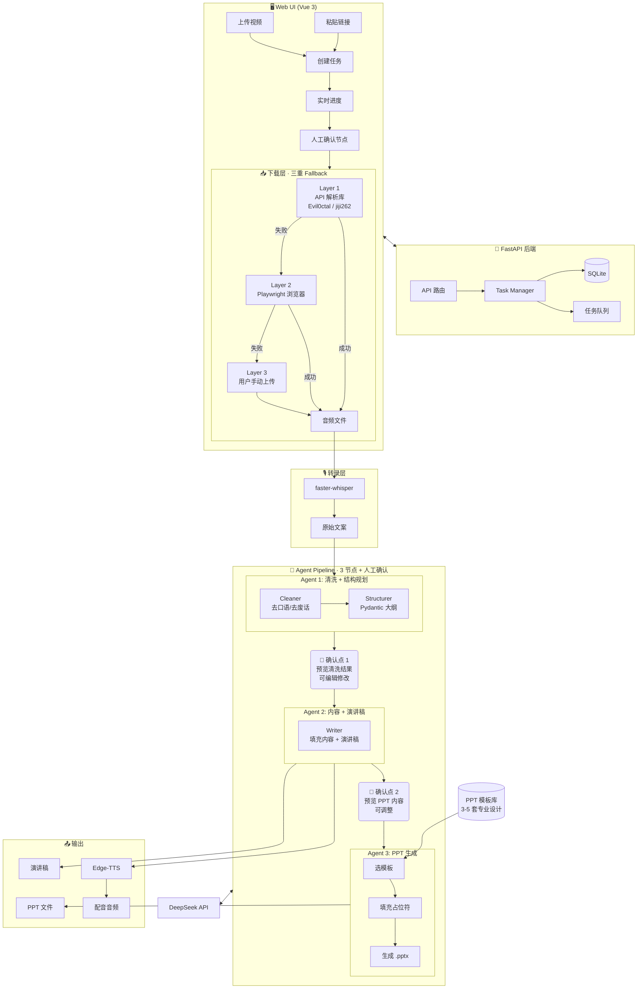

# AI 视频二创工具 — 项目方案

> **实现状态（2026-05）**：当前代码以 `pipeline.py` 直接编排 Agent 为主（未使用 LangGraph Graph）。
> 下载为 **双层 Fallback**（页面解析 + 用户上传）。PPT 为 **python-pptx 程序化生成**（非 .pptx 模板填充）。
> 视频输出使用 **Remotion**。后台任务在 FastAPI 进程内 `asyncio.create_task` 执行。
> 详细以 `README.md` 和代码为准。

## 项目定位

输入抖音视频链接，自动提取文案，通过 AI Agent 流水线清洗整理，生成 PPT + 演讲稿 + 配音，辅助快速产出 AI 教程类视频。

---

## 一、整体流程

```
用户粘贴抖音链接
    │
    ▼
━━━━━━━━━━━━━━━━━━━━━━━━━━━━━━━━━━
      📥 下载层 · 三重 Fallback
━━━━━━━━━━━━━━━━━━━━━━━━━━━━━━━━━━
  Layer 1: 社区 API 解析库 (优先)
  Layer 2: Playwright 浏览器 (补充)
  Layer 3: 用户手动上传 (兜底)
    │
    ▼
[ffmpeg] → 提取音频轨道
    │
    ▼
[faster-whisper] → ASR 语音识别，产出原始文案
    │
    ▼
━━━━━━━━━━━━━━━━━━━━━━━━━━━━━━━━━━
      🧠 LangGraph Agent Pipeline
      (3 节点 + 人工确认 Checkpoint)
━━━━━━━━━━━━━━━━━━━━━━━━━━━━━━━━━━
    │
    ├─ Agent 1: Cleaner + Structurer（合并）
    │    清洗文案 → 输出 Pydantic 大纲
    │    → 👤 用户确认/修改
    │
    ├─ Agent 2: Writer
    │    填充每页内容 + 写演讲稿
    │    → 👤 用户预览/调整
    │
    └─ Agent 3: PPT Generator
         选模板 → 填充占位符 → 生成 .pptx
    │
    ▼
PPT 文件 + 演讲稿 + 配音音频
    │
    ▼
用户在页面下载，自行拼接发布
```

---

## 二、架构图



---

## 三、技术栈

### 后端

| 组件 | 技术 | 说明 |
|------|------|------|
| Web 框架 | FastAPI | 异步后端 |
| Agent 编排 | pipeline.py + LangChain | 三阶段流水线（人工确认节点） |
| LLM | DeepSeek API | 文案清洗/内容生成 |
| 下载 | api_parser.py | 解析抖音分享页获取无水印视频 |
| 上传兜底 | POST upload_video | 用户手动上传 |
| 音视频 | ffmpeg | 音频提取 |
| ASR | faster-whisper | 语音转文字 |
| PPT | python-pptx 程序化 | 三套主题（tech_blue 等） |
| 视频 | Remotion 4.x | 竖屏 1080×1920 |
| TTS | edge-tts | 语音合成 |
| 任务执行 | asyncio.create_task | 进程内异步（队列待后续） |
| 数据库 | SQLite + SQLAlchemy | 任务/历史 |

### 前端

| 组件 | 技术 |
|------|------|
| 框架 | Vue 3 + Vite |
| UI | Element Plus / Naive UI |
| 状态管理 | Pinia |
| 图表 | ECharts（后续 Token 用量）|

---

## 四、下载层 · 双层 Fallback（当前实现）

| 层级 | 方案 | 说明 |
|------|------|------|
| Layer 1 | api_parser.py | 解析抖音分享页 `_ROUTER_DATA`，下载无水印视频 |
| Layer 2 | 用户上传 | 自动下载失败后，前端提示上传，调用 `upload_video` |

~~Layer 2 Playwright~~ 已移除，未纳入当前版本。

---

## 五、LangGraph Agent 详细设计

### 设计原则

1. **3 个 Agent，不接太长链路** — 减少累计错误放大
2. **Pydantic schema 硬约束** — 每个 Agent 的输入输出都是结构化模型，不用自由文本传递
3. **人工确认 Checkpoint** — 关键节点让用户看一眼，防止错误累积
4. **断点续跑** — 失败只重跑当前节点，不重跑前面

### State 定义

```python
class SlideOutline(BaseModel):
    title: str                    # 页面标题
    key_points: list[str]         # 核心要点
    code_example: str | None      # 代码示例（如果有）

class VideoProcessState(TypedDict):
    raw_text: str                  # Whisper 原始输出
    cleaned_text: str              # Agent 1 清洗后
    slide_outline: list[SlideOutline]  # Agent 1 结构化大纲
    slide_content: list[SlideContent]  # Agent 2 填充后内容
    ppt_template: str              # 用户选择的模板
    ppt_path: str                  # Agent 3 生成的 PPT
    speech_text: str               # Agent 2 生成的演讲稿
    task_id: str
    status: str                    # waiting | downloading | transcribing
                                   # | cleaning | confirm_1
                                   # | writing | confirm_2
                                   # | generating | completed | failed
    current_step: int              # 断点续跑用
```

### Agent 职责

| Agent | 职责 | 输入 | 输出 |
|-------|------|------|------|
| **Agent 1: Cleaner + Structurer** | 去口语化 → 提炼要点 → 规划 PPT 结构 | 原始转录文本 | `list[SlideOutline]`（Pydantic 约束）|
| **Agent 2: Writer** | 填充每页详细内容 + 写演讲稿 | `list[SlideOutline]` | 每页完整内容 + 演讲口播稿 |
| **Agent 3: PPT Generator** | 选模板 → 填充占位符 → 生成 .pptx 文件 | 结构化内容 + 模板选择 | `.pptx` 文件路径 |

---

## 六、PPT / 视频主题（当前实现）

**当前方案**：使用 python-pptx **程序化构建**幻灯片（深色科幻风），非预置 .pptx 占位符填充。
Remotion 视频组件与 PPT 共用三套主题 ID：

| ID | 名称 | 适用 |
|----|------|------|
| tech_blue | 科技蓝 | AI 教程 |
| clean_white | 简约白 | 通用知识 |
| warm_orange | 活力橙 | 轻松科普 |

~~原 .pptx 模板库方案~~ 保留在设计文档中，后续可恢复。

---

## 七、稳定性保障

### Agent 流异常处理

| 问题 | 方案 |
|------|------|
| Prompt 漂移 | Pydantic schema 硬约束输出格式，不用自由文本传递中间结果 |
| 错误累计放大 | 人工确认 Checkpoint + 每个 Agent 独立校验再传递 |
| 调试困难 | 每步结果写入数据库，前后端均可查看中间产物 |

### 断点续跑

```python
# 任务状态机
status_flow = {
    "waiting": ["downloading"],
    "downloading": ["transcribing", "failed"],
    "transcribing": ["cleaning", "failed"],
    "cleaning": ["confirm_1", "failed"],       # 人工确认
    "confirm_1": ["writing", "cleaning"],       # 确认通过或退回修改
    "writing": ["confirm_2", "failed"],
    "confirm_2": ["generating", "writing"],     # 确认通过或退回修改
    "generating": ["completed", "failed"],
}
```

### 下载鲁棒性

| 问题 | 方案 |
|------|------|
| API 解析失败 | 自动降级到 Playwright |
| Playwright 被风控 | 提示用户手动上传 |
| 视频下载中断 | 自动重试 3 次 |
| 所有方式都失败 | 可选"仅文案模式"（跳过视频，手动粘文案）|

---

## 八、项目目录结构

```
douyin_ppt/
├── backend/
│   ├── app/
│   │   ├── api/                   # tasks.py, events.py
│   │   ├── core/                  # config, database, utils
│   │   ├── models/
│   │   ├── services/
│   │   │   ├── downloader/api_parser.py
│   │   │   ├── pipeline.py
│   │   │   ├── remotion_service.py
│   │   │   └── asr.py, tts.py, audio.py, events.py
│   │   └── agents/                # cleaner, writer, ppt_generator
│   ├── remotion/                  # Remotion 竖屏视频
│   ├── data/                      # 运行时输出（gitignored）
│   └── main.py
├── frontend/
│   ├── src/views/Home.vue, History.vue
│   ├── src/stores/task.ts
│   ├── nginx.conf
│   └── Dockerfile
└── docker-compose.yml
```

---

## 九、Web 页面功能

### 主页 — 新建任务

```
┌──────────────────────────────────────────────┐
│  🎬 AI 视频二创工具                            │
├──────────────────────────────────────────────┤
│                                              │
│  ○ 粘贴链接           ○ 上传视频              │
│                                              │
│  抖音链接:  [_____________________________]  │
│                                              │
│  或上传本地视频:  [📁 选择文件]              │
│                                              │
│  [🎯 开始处理]                               │
│                                              │
│  ─── 当前处理进度 ───                       │
│  Claude Code 5.0 新功能介绍                  │
│  📥 下载视频    ██████████ 100%              │
│  🎙️ 转录文案    ████████░░ 80%              │
│  🧹 AI 清洗     ██░░░░░░░░ 20%    [👀 预览] │
│  📊 生成 PPT    ⏳ 等待中                     │
│  🔊 生成配音    ⏳ 等待中                     │
│                                              │
│  预计剩余: 2分钟                             │
└──────────────────────────────────────────────┘
```

### 人工确认节点

```
┌──────────────────────────────────────────────┐
│  ✏️ 确认清洗结果                              │
├──────────────────────────────────────────────┤
│                                              │
│  原文（Whisper 转录）   清洗后（AI 整理）     │
│  ┌──────────────────┐  ┌──────────────────┐  │
│  │ 大家好今天給     │  │ Claude Code 5.0  │  │
│  │ 大家介紹下       │  │ 新功能介绍       │  │
│  │ Claude Code 5.0 │  │                  │  │
│  │ 額...這個版本   │  │ • 支持多文件編輯  │  │
│  │ 主要更新了       │  │ • 性能提升 2 倍  │  │
│  │ 那個多文件編輯   │  │ • Agent 模式增強  │  │
│  └──────────────────┘  └──────────────────┘  │
│                                              │
│  [↩ 退回修改]  [✓ 确认，继续]               │
└──────────────────────────────────────────────┘
```

### 历史页

```
┌──────────────────────────────────────────────┐
│  历史记录    [🔍 搜索]                       │
├──────────────────────────────────────────────┤
│                                              │
│  ✅ Claude Code 介绍    20分钟前             │
│     ├ 📊 PPT    ├ 📝 文案    ├ 🎵 配音      │
│     └ 🔄 重新生成                            │
│                                              │
│  ✅ Hermes 使用指南     1小时前              │
│     ├ 📊 PPT    ├ 📝 文案                    │
│                                              │
│  ❌ OpenClaw 教程       Layer 1+2 都失败     │
│     └ 📤 上传视频继续                        │
└──────────────────────────────────────────────┘
```

---

## 十、鲁棒性设计

| 问题 | 方案 |
|------|------|
| 抖音下载失败 | 三重 Fallback：API → Playwright → 用户上传 |
| API 解析库更新滞后 | 可选多个社区库作为备用源 |
| Whisper 转录不准 | 原始文案保留可查，DeepSeek 二次修正 |
| DeepSeek 限流 | 自动重试 + 任务队列排队 |
| Agent 输出格式异常 | Pydantic schema 校验 + 自动重试该步骤 |
| PPT 不够美观 | 预置设计师模板，Agent 只做填充不控制样式 |
| 任务处理中断 | 断点续跑，从失败步骤重试 |
| 长视频耗时过久 | 限制 < 30 分钟，超过提示缩短 |

---

## 十一、后续扩展方向

- [ ] 任务队列（Celery/ARQ）与并发控制
- [ ] 支持更多平台（B站、小红书、YouTube）
- [ ] Token 用量看板
- [ ] PPT .pptx 模板库（替代程序化生成）
- [ ] 多语言输出（翻译 Agent）
- [ ] 批量处理
- [ ] 封面图生成

已实现：纯文案模式、上传视频模式、Remotion 竖屏视频、失败断点重试、主题选择。
