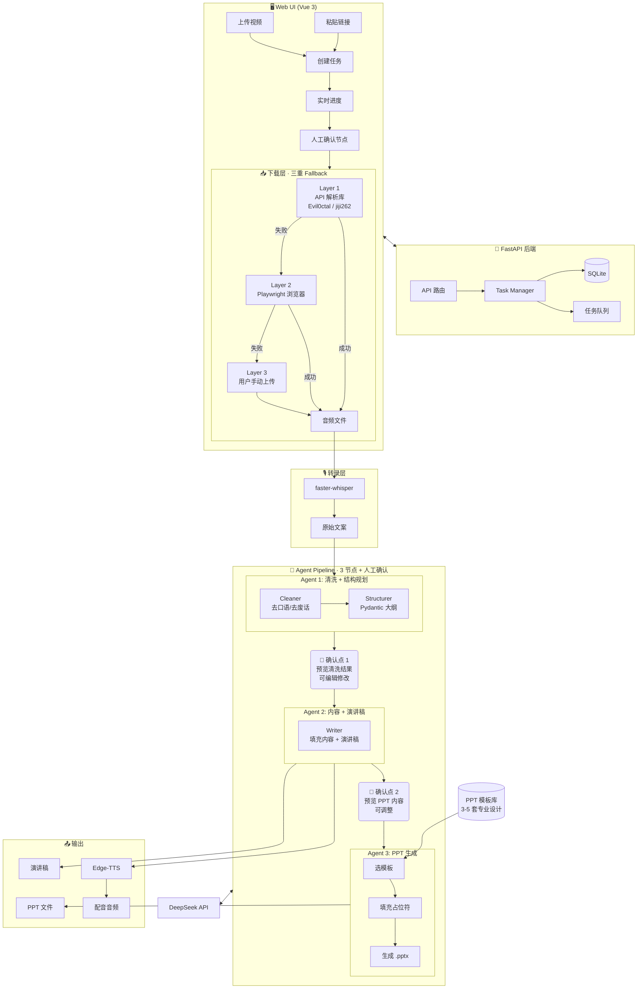

# AI 视频二创工具 — 项目方案

## 项目定位

输入抖音视频链接，自动提取文案，通过 AI Agent 流水线清洗整理，生成 PPT + 演讲稿 + 配音，辅助快速产出 AI 教程类视频。

---

## 一、整体流程

```
用户粘贴抖音链接
    │
    ▼
━━━━━━━━━━━━━━━━━━━━━━━━━━━━━━━━━━
      📥 下载层 · 三重 Fallback
━━━━━━━━━━━━━━━━━━━━━━━━━━━━━━━━━━
  Layer 1: 社区 API 解析库 (优先)
  Layer 2: Playwright 浏览器 (补充)
  Layer 3: 用户手动上传 (兜底)
    │
    ▼
[ffmpeg] → 提取音频轨道
    │
    ▼
[faster-whisper] → ASR 语音识别，产出原始文案
    │
    ▼
━━━━━━━━━━━━━━━━━━━━━━━━━━━━━━━━━━
      🧠 LangGraph Agent Pipeline
      (3 节点 + 人工确认 Checkpoint)
━━━━━━━━━━━━━━━━━━━━━━━━━━━━━━━━━━
    │
    ├─ Agent 1: Cleaner + Structurer（合并）
    │    清洗文案 → 输出 Pydantic 大纲
    │    → 👤 用户确认/修改
    │
    ├─ Agent 2: Writer
    │    填充每页内容 + 写演讲稿
    │    → 👤 用户预览/调整
    │
    └─ Agent 3: PPT Generator
         选模板 → 填充占位符 → 生成 .pptx
    │
    ▼
PPT 文件 + 演讲稿 + 配音音频
    │
    ▼
用户在页面下载，自行拼接发布
```

---

## 二、架构图



---

## 三、技术栈

### 后端

| 组件 | 技术 | 说明 |
|------|------|------|
| Web 框架 | FastAPI | 异步后端 |
| Agent 编排 | LangGraph | 多 Agent 流水线核心 |
| LLM | DeepSeek API | 文案清洗/内容生成 |
| API 解析库 | Evil0ctal/Douyin_TikTok_Download_API | 第一优先下载方案 |
| 浏览器 | Playwright | 第二优先下载方案（兜底） |
| 音视频 | ffmpeg | 音频提取 |
| ASR | faster-whisper | 语音转文字 |
| PPT | python-pptx + 预置模板 | 基于模板填充内容 |
| TTS | edge-tts | 语音合成（免费、中文好）|
| 任务队列 | Celery / ARQ | 异步处理耗时任务 |
| 数据库 | SQLite + SQLAlchemy | 任务/配置/历史 |

### 前端

| 组件 | 技术 |
|------|------|
| 框架 | Vue 3 + Vite |
| UI | Element Plus / Naive UI |
| 状态管理 | Pinia |
| 图表 | ECharts（后续 Token 用量）|

---

## 四、下载层 · 三重 Fallback

| 层级 | 方案 | 适用场景 | 预期成功率 |
|------|------|---------|-----------|
| Layer 1 | 社区 API 解析库（Evil0ctal / jiji262）| 普通公开视频 | ~80% |
| Layer 2 | Playwright 浏览器模拟（stealth 插件）| Layer 1 失效时 | ~15% |
| Layer 3 | 用户手动上传视频文件 | 前两层都失败 | 100%（用户提供）|

**第一版开发顺序**：先做 Layer 1 + 3，Layer 2 作为后续加强。

---

## 五、LangGraph Agent 详细设计

### 设计原则

1. **3 个 Agent，不接太长链路** — 减少累计错误放大
2. **Pydantic schema 硬约束** — 每个 Agent 的输入输出都是结构化模型，不用自由文本传递
3. **人工确认 Checkpoint** — 关键节点让用户看一眼，防止错误累积
4. **断点续跑** — 失败只重跑当前节点，不重跑前面

### State 定义

```python
class SlideOutline(BaseModel):
    title: str                    # 页面标题
    key_points: list[str]         # 核心要点
    code_example: str | None      # 代码示例（如果有）

class VideoProcessState(TypedDict):
    raw_text: str                  # Whisper 原始输出
    cleaned_text: str              # Agent 1 清洗后
    slide_outline: list[SlideOutline]  # Agent 1 结构化大纲
    slide_content: list[SlideContent]  # Agent 2 填充后内容
    ppt_template: str              # 用户选择的模板
    ppt_path: str                  # Agent 3 生成的 PPT
    speech_text: str               # Agent 2 生成的演讲稿
    task_id: str
    status: str                    # waiting | downloading | transcribing
                                   # | cleaning | confirm_1
                                   # | writing | confirm_2
                                   # | generating | completed | failed
    current_step: int              # 断点续跑用
```

### Agent 职责

| Agent | 职责 | 输入 | 输出 |
|-------|------|------|------|
| **Agent 1: Cleaner + Structurer** | 去口语化 → 提炼要点 → 规划 PPT 结构 | 原始转录文本 | `list[SlideOutline]`（Pydantic 约束）|
| **Agent 2: Writer** | 填充每页详细内容 + 写演讲稿 | `list[SlideOutline]` | 每页完整内容 + 演讲口播稿 |
| **Agent 3: PPT Generator** | 选模板 → 填充占位符 → 生成 .pptx 文件 | 结构化内容 + 模板选择 | `.pptx` 文件路径 |

---

## 六、PPT 模板体系

**核心理念**：不靠 Agent 从零写 PPT，而是 Agent 往设计师做好的模板里填内容。

```
预置 3-5 套专业 PPT 模板（.pptx 格式）
  ├── 科技蓝  → 适合 AI 工具介绍、技术教程
  ├── 简约白  → 适合通用教程、知识分享
  ├── 活力橙  → 适合入门科普、轻松话题
  └── (后续扩展)

模板包含:
  ├── Slide Master（统一配色/字体/间距）
  ├── 预置布局（标题页、内容页、代码页、总结页）
  ├── 占位符标记（Agent 通过 python-pptx 定位填充）
  └── 动画效果（保留模板原有动画）
```

**模板来源**：从 Canva / 稿定设计 / Slidesgo 等下载免费模板，转为 .pptx 作为基底。

---

## 七、稳定性保障

### Agent 流异常处理

| 问题 | 方案 |
|------|------|
| Prompt 漂移 | Pydantic schema 硬约束输出格式，不用自由文本传递中间结果 |
| 错误累计放大 | 人工确认 Checkpoint + 每个 Agent 独立校验再传递 |
| 调试困难 | 每步结果写入数据库，前后端均可查看中间产物 |

### 断点续跑

```python
# 任务状态机
status_flow = {
    "waiting": ["downloading"],
    "downloading": ["transcribing", "failed"],
    "transcribing": ["cleaning", "failed"],
    "cleaning": ["confirm_1", "failed"],       # 人工确认
    "confirm_1": ["writing", "cleaning"],       # 确认通过或退回修改
    "writing": ["confirm_2", "failed"],
    "confirm_2": ["generating", "writing"],     # 确认通过或退回修改
    "generating": ["completed", "failed"],
}
```

### 下载鲁棒性

| 问题 | 方案 |
|------|------|
| API 解析失败 | 自动降级到 Playwright |
| Playwright 被风控 | 提示用户手动上传 |
| 视频下载中断 | 自动重试 3 次 |
| 所有方式都失败 | 可选"仅文案模式"（跳过视频，手动粘文案）|

---

## 八、项目目录结构

```
douyin_ppt/
├── backend/
│   ├── app/
│   │   ├── api/                   # FastAPI 路由
│   │   │   ├── tasks.py           # 任务创建/查询/下载/重试
│   │   │   └── config.py          # 模板/配置接口
│   │   ├── core/
│   │   │   ├── database.py        # SQLite 连接
│   │   │   └── config.py          # 全局配置
│   │   ├── models/
│   │   │   ├── task.py            # 任务模型
│   │   │   └── schemas.py         # Pydantic schema
│   │   ├── services/
│   │   │   ├── downloader/
│   │   │   │   ├── __init__.py    # 统一入口
│   │   │   │   ├── api_parser.py  # Layer 1: API 解析库
│   │   │   │   ├── playwright.py  # Layer 2: Playwright
│   │   │   │   └── upload.py      # Layer 3: 用户上传
│   │   │   ├── asr.py             # Whisper 转录
│   │   │   └── tts.py             # Edge-TTS 合成
│   │   ├── agents/
│   │   │   ├── graph.py           # Graph 组装
│   │   │   ├── cleaner.py         # Agent 1: 清洗+规划
│   │   │   ├── writer.py          # Agent 2: 内容+演讲稿
│   │   │   └── ppt_generator.py   # Agent 3: PPT 生成
│   │   └── templates/             # PPT 模板文件 (.pptx)
│   │       ├── tech_blue.pptx
│   │       ├── clean_white.pptx
│   │       └── warm_orange.pptx
│   ├── requirements.txt
│   └── main.py
├── frontend/
│   ├── src/
│   │   ├── views/
│   │   │   ├── Home.vue           # 新建任务
│   │   │   └── History.vue        # 历史记录
│   │   ├── components/
│   │   │   ├── TaskCard.vue       # 任务卡片
│   │   │   ├── ProgressBar.vue    # 进度条
│   │   │   ├── TextReview.vue     # 文案预览/编辑
│   │   │   └── SlidePreview.vue   # PPT 预览
│   │   ├── api/
│   │   │   └── index.ts           # 后端 API 封装
│   │   └── stores/
│   │       └── task.ts            # Pinia 状态
│   ├── package.json
│   └── vite.config.ts
├── docker-compose.yml
└── PROJECT_PLAN.md
```

---

## 九、Web 页面功能

### 主页 — 新建任务

```
┌──────────────────────────────────────────────┐
│  🎬 AI 视频二创工具                            │
├──────────────────────────────────────────────┤
│                                              │
│  ○ 粘贴链接           ○ 上传视频              │
│                                              │
│  抖音链接:  [_____________________________]  │
│                                              │
│  或上传本地视频:  [📁 选择文件]              │
│                                              │
│  [🎯 开始处理]                               │
│                                              │
│  ─── 当前处理进度 ───                       │
│  Claude Code 5.0 新功能介绍                  │
│  📥 下载视频    ██████████ 100%              │
│  🎙️ 转录文案    ████████░░ 80%              │
│  🧹 AI 清洗     ██░░░░░░░░ 20%    [👀 预览] │
│  📊 生成 PPT    ⏳ 等待中                     │
│  🔊 生成配音    ⏳ 等待中                     │
│                                              │
│  预计剩余: 2分钟                             │
└──────────────────────────────────────────────┘
```

### 人工确认节点

```
┌──────────────────────────────────────────────┐
│  ✏️ 确认清洗结果                              │
├──────────────────────────────────────────────┤
│                                              │
│  原文（Whisper 转录）   清洗后（AI 整理）     │
│  ┌──────────────────┐  ┌──────────────────┐  │
│  │ 大家好今天給     │  │ Claude Code 5.0  │  │
│  │ 大家介紹下       │  │ 新功能介绍       │  │
│  │ Claude Code 5.0 │  │                  │  │
│  │ 額...這個版本   │  │ • 支持多文件編輯  │  │
│  │ 主要更新了       │  │ • 性能提升 2 倍  │  │
│  │ 那個多文件編輯   │  │ • Agent 模式增強  │  │
│  └──────────────────┘  └──────────────────┘  │
│                                              │
│  [↩ 退回修改]  [✓ 确认，继续]               │
└──────────────────────────────────────────────┘
```

### 历史页

```
┌──────────────────────────────────────────────┐
│  历史记录    [🔍 搜索]                       │
├──────────────────────────────────────────────┤
│                                              │
│  ✅ Claude Code 介绍    20分钟前             │
│     ├ 📊 PPT    ├ 📝 文案    ├ 🎵 配音      │
│     └ 🔄 重新生成                            │
│                                              │
│  ✅ Hermes 使用指南     1小时前              │
│     ├ 📊 PPT    ├ 📝 文案                    │
│                                              │
│  ❌ OpenClaw 教程       Layer 1+2 都失败     │
│     └ 📤 上传视频继续                        │
└──────────────────────────────────────────────┘
```

---

## 十、鲁棒性设计

| 问题 | 方案 |
|------|------|
| 抖音下载失败 | 三重 Fallback：API → Playwright → 用户上传 |
| API 解析库更新滞后 | 可选多个社区库作为备用源 |
| Whisper 转录不准 | 原始文案保留可查，DeepSeek 二次修正 |
| DeepSeek 限流 | 自动重试 + 任务队列排队 |
| Agent 输出格式异常 | Pydantic schema 校验 + 自动重试该步骤 |
| PPT 不够美观 | 预置设计师模板，Agent 只做填充不控制样式 |
| 任务处理中断 | 断点续跑，从失败步骤重试 |
| 长视频耗时过久 | 限制 < 30 分钟，超过提示缩短 |

---

## 十一、后续扩展方向

- 支持更多平台（B站、小红书、YouTube）
- Token 用量看板（每日/每任务消耗统计）
- PPT 模板自定义上传
- 多语言输出（翻译 Agent）
- 批量处理（批量链接输入）
- 封面图生成（Image Generation Agent）
- 纯文案模式（不下载视频，直接粘贴文案开始）
