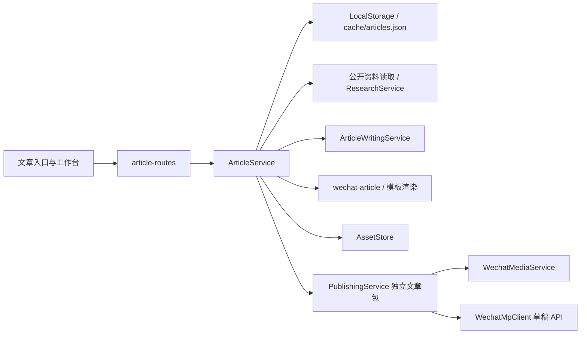
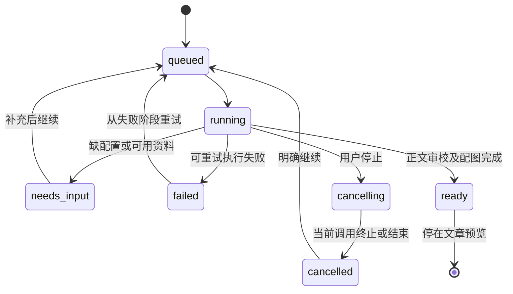

# 公众号六模板与自动创作实施文档

日期：2026-10-10。适用项目：抖创工坊 / `doyin_ai_video`。

本文面向产品审阅、实现与验收，依据当前 checkout 的源码、工作区改动及测试结果编写。用户已认可六模板和自动创作方向，并要求先交付本文。开发验收阶段源码和文档仅保留本地；用户后续已授权推送 `origin/main` 并重启项目，交付约定见第16节；不修改已有微信草稿，不创建真实测试草稿，不正式发布或群发。

## 1. 当前状态与证据

| 范围 | 当前状态 | 依据与限制 |
| --- | --- | --- |
| 独立文章六步创作 | 现有能力 | `ArticleService`、`ArticleWritingService` 和 `/articles/:id`，逐步触发；不依赖视频任务 |
| 公开资料读取、事实引用校验 | 现有能力 | `article-sources.ts`、`research-service.ts`、`article-writing.ts`；不可读页面不得进入正文依据 |
| 本地文章包、微信公众号草稿提交 | 现有能力 | `PublishingService.createIndependentArticle`、`WechatMpClient.createDraft`；现有发布中心人工触发 |
| 更新已有微信公众号草稿 | 已在此前任务实现并推送 | 基线提交 `de6fa662beecfaf626a7cb26b321d25739eb7380`；本次不调用该通路 |
| 六套新版模板、旧模板兼容、参数与默认设置 | 已实现，保留本地 | 见第 5 节；服务端、HTTP、组件测试通过 |
| 当前真实稿件的模板预览 | 已实现，隔离浏览器验收通过 | 同一服务端渲染器；六模板、图片、参数、默认、保存刷新、390px 均验收 |
| 输入自动识别、后台连续编排、取消与恢复 | 已实现，保留本地 | 服务端 runId、检查点、版本与互斥；实际浏览器取消、晚到响应、刷新及续跑验收 |
| 自动匹配模板、自动生成可交付图片 | 已实现本地文字示意图 | 浏览器本地渲染封面和1～2张正文 PNG，入素材库；非云端 AI 生图、非现场照片 |
| 一键从文章预览保存公众号草稿 | 已实现，隔离 HTTP 验收 | 复用现有建包及草稿提交；明确确认、版本防护、幂等、不确定结果禁止重复。未调用真实微信 |

初次交付文档时，六模板相关测试合计 **26 项通过**：文章服务/渲染/模板/组件 18 项，文章 HTTP 与已有草稿更新回归 8 项。全量 `npm test` 为 **1302 项，1301 通过、1 跳过、0 失败**；`npm run check` 和 `npm run build` 通过。全量包含其他模块的夹具测试，不等于微信后台真实验收，也不证明自动创作已完成。

参考现有设计：

- [热点到微信公众号文章创作规格](../specs/2026-09-30-hotspot-wechat-writing-design.md)
- [现有文章实施计划](2026-09-30-hotspot-wechat-writing.md)
- [微信公众号文章发布规格](../specs/2026-09-18-wechat-mp-article-publish-design.md)

本文将默认交互从逐步确认改为自动创作。旧规格中的手动资料/提纲确认继续用于高级编辑；安全读取、来源校验、版本守卫、人工草稿提交仍适用。

## 2. 现状痛点与目标

### 2.1 设计前基线

设计前 `ArticlesPage.tsx` 只接收最多 500 字的选题关键词，创建后进入 `ArticleDetailPage.tsx` 的六步工作台。用户需要生成三个方向、选方向、添加和读取资料、整理事实、确认资料、生成和确认提纲、生成初稿、审校并确认、规划配图、选择图片和模板、建包，再去发布中心提交草稿。

这些中间产物有价值，但全部要求用户逐次操作，会打断“看到内容或突然有灵感，想马上成文”的场景。模板此前主要提供固定样式；配图规划只有提示词，不会自动产出图片。AI 故障目前多数收敛为通用“检查配置、资料与输出格式”，用户难以知道该补资料还是该重试模型。

### 2.2 目标

默认入口接收灵感文字、粘贴正文或公开网页链接。系统识别输入，提取可用资料，选择合适模板，连续完成资料整理、提纲、正文、审校和配图，输出完整可编辑文章预览。用户只在必要信息缺失时补充输入；不再逐个确认中间产物。

完成后停在预览。用户可编辑、换模板、更换图片，核对事实与账号，然后明确点击“保存到公众号草稿箱”。保存失败保留本地成果，已有配置复用，不每次重复配置。

### 2.3 非目标

- 不自动发布、群发、定时发布，不因生成完成自动调用微信。
- 不自动更新任何历史微信草稿，也不将新版模板批量应用到旧文章。
- 不实现无限网页搜索、登录网站抓取、验证码绕过或平台 Cookie 共享。
- 首版不扩展 PDF、Word、视频、聊天附件解析；文字与普通公开网页优先。
- 不添加新的付费生图/搜索服务，不自动开启 Jina/Exa 或改写安全配置。
- 不把私人视频、聊天或敏感个人资料纳入默认外部 AI 输入；不读取用户其他资料进行“智能补全”。
- 不把 AI 校验通过、AI 审校完成或来源 ID 存在表述为事实已核实。

## 3. 三步用户旅程与高级编辑

### 第一步：丢进灵感或资料

`/articles` 默认显示一个多行输入框：“写下灵感、粘贴资料，或放一个公开链接”。主要按钮为“自动创作”。框下用一句话说明内容将使用当前 AI 配置处理，避免在已有用户文字授权之外自动上传其他文件。

折叠“高级设置”保留读者、目标、作者立场、篇幅、表达样本、领域、写作结构和手选模板。大多数输入不需要展开。现有热点入口保留，热榜标题仍只是线索。

AI 尚未配置时，保留输入与创作记录，明确指向现有设置页；用户配置后继续同一记录。微信配置不作为文章生成前置条件，在用户准备保存微信草稿时才检查。

### 第二步：查看和修改完整文章

创建记录后即进入工作台，真实显示“读取资料 / 整理事实 / 组织提纲 / 写正文 / 审校 / 配图”等状态。只展示已实际开始或完成的步骤，不填虚假百分比；失败指出具体阶段及下一步动作。

生成完成默认展示文章手机预览，旁边提供正文编辑、六模板切换、阅读参数、封面与正文图。保留资料来源、局限和 AI 修改说明；中间选题、事实卡片和提纲收进高级编辑，仍可查看和修改。

内容不足时停在“需要补充资料”，直接给出缺项：“此链接未读到正文，请换公开链接或粘贴正文”。短灵感可以被理解为用户的观点/写作意图，不能从一句“想写某产品更新”编造版本、数字、使用体验和文章来源。没有可靠正文时，先要求用户提供事实材料；首版不假装具备自动全网研究。

### 第三步：明确保存微信草稿

用户确认当前正文与使用权，点击“保存到公众号草稿箱”，看到标题、封面、目标账号和保存动作。只有该动作启动不可变文章包和草稿事务。

成功后显示草稿 ID、账号、标题和保存时间，提供已有发布记录入口。结果不确定时停止自动重试，让用户先到后台核对；不能以网络超时为由重复建草稿。正式发布/群发始终不在该入口。

### 高级编辑与旧文章

现有逐步工作台保留为高级模式。用户改资料或正文时，继续遵守下游失效规则，旧内容保留为参考。自动模式应显示“AI 已完成审校，待你最终核对”，不能用 `reviewed=true` 冒充用户审阅。

旧文章默认保持原模式和原模板，只有显式进入自动创作或选择新版模板才改变。模式切换不删除正文；存在未保存编辑时先保存或由用户明确放弃。运行中切换页面不等于取消后台任务，运行中切换编辑模式应先停下任务再编辑。

## 4. 当前真实架构与复用方式



当前源码落点：

| 文件 | 当前职责 | 本轮复用方式 |
| --- | --- | --- |
| `src/lib/articles.ts` | 创作记录、版本、串行落盘、下游失效、步骤执行、预览与建包 | 保持文章真源；扩展运行预约与自动任务字段，不另建一套正文索引 |
| `src/lib/article-writing.ts` | 六步 AI 调用及输出校验 | 原有选题/事实/提纲/正文/审校/配图规划复用；补充取消信号与安全错误分类 |
| `src/lib/article-sources.ts` | 公开 HTTPS 校验、DNS 固定、正文提取 | 自动输入解析只使用这里的 URL 规则，不裸 `fetch` 外部 URL |
| `src/lib/research-service.ts` | 配置受控的资料读取与搜索 | 当前 `app.ts` 的 `readResearchSource` 已接入；不自动改变 provider 开关 |
| `src/lib/wechat-article.ts` | 清洗正文、图片占位、来源、微信 HTML 限额 | 唯一排版和交付渲染器，不在前端复制一份规则 |
| `src/lib/wechat-templates.ts` | 旧模板、新模板元数据、排版参数校验 | 明确模板版本与默认值 |
| `src/lib/wechat-layout-design.ts` | 六模板结构与内联样式 | 保持纯函数，无配置/网络/磁盘读取 |
| `src/lib/assets-store.ts` | 图片/音频归属、路径与索引 | 自动产出的图片也经过 `add` 入库、`resolveFile` 解析 |
| `src/lib/publishing-service.ts` | 独立文章包、预览、草稿提交与结果不确定保护 | 新一键按钮只编排现有服务，不直接另调微信 SDK |
| `src/lib/wechat-mp-client.ts` | 微信凭据注入、token、图片上传、草稿新增/更新 | 继续只到草稿；不增加发布/群发方法 |
| `src/app.ts` | 服务和动态配置装配 | 注入现有 AI resolver、素材与发布依赖，独立后端/Electron 共用 |
| `renderer/src/services/api.ts` | 会话、API、错误转换 | 扩展自动任务查询/启动/停止；复用本机会话自动恢复 |
| `renderer/src/pages/ArticlesPage.tsx` | 列表与创建入口 | 默认自动输入；手动模式收进高级入口 |
| `renderer/src/pages/ArticleDetailPage.tsx` | 手动六步、未保存编辑、图片与交付 | 增加自动进度与完整预览，保留高级编辑及输入保护 |

现有 `ImagePromptService` 和文章 `illustrations` **只编写提示词，不执行生图**。不能将“已生成配图规划”当作“已有封面/文内 PNG”。

## 5. 六模板系统：已实现的行为

### 5.1 模板定义

所有模板使用微信兼容的内联样式、系统字体和普通块级元素。不是只切换主题色。

| 模板 / ID | 适用内容 | 结构差异 | 默认主题色 / 正文字号 / 行距 |
| --- | --- | --- | --- |
| 科技解读 `tech-explainer` | AI、工具、产品说明 | 框内导语，细竖线小标题，解释型段落，章节图与来源分隔 | `#2563eb` / 16 px / 1.85 |
| 实操教程 `practical-guide` | 步骤、代码、截图 | 章节序号、标题底线，独立代码块，步骤图与图注 | `#087f72` / 16 px / 1.80 |
| 商务简报 `business-brief`（新版） | 新闻、行业变化、已有数据解释 | 导读摘要条，实色标题带，紧凑章节分隔，来源面板 | `#1e40af` / 16 px / 1.80 |
| 深度长文 `deep-reading` | 分析、观点、长篇解释 | 衬线系统字体，居中标题，较大段距，首行缩进、克制引用 | `#555165` / 17 px / 2.00 |
| 图片故事 `image-story` | 图片叙事、案例、体验材料 | 对应章节图置于标题前，宽图、少边饰、较轻标题 | `#b4533c` / 16 px / 1.90 |
| 清单推荐 `resource-list` | 工具、资源、对比清单 | 独立边框卡片、分组标题，来源虚线面板 | `#496b38` / 16 px / 1.80 |

模板不自动补写内容：无数据就不生成数据图，无体验素材就不写亲身体验；教程模板的序号只是已有章节顺序。图片仍保持比例，引用、正文、代码和来源不会因选模板被删除。

### 5.2 旧模板兼容

旧 ID `default`、`minimal-read`、`business-brief`、`tutorial-steps`、`daily-news` 保留。记录没有 `layoutVersion:2` 时继续旧渲染。尤其 `business-brief` 同名但结构不同，必须用版本字段区分，不能根据 ID 把旧文章静默升级。

新模板选择保存 `layoutVersion:2`。从新版选择旧模板时显式清除版本和参数；前端通过 `layoutVersion:null` 表达清除。旧文章不会因为应用重启或修改“新文章默认”改变。

### 5.3 可配置项、恢复和默认

- `themeColor`：严格六位十六进制色，不能提交任意 CSS。
- `fontSize`：15、16、17、18 px，必须为整数。
- `lineHeight`：服务端范围 1.5～2.1，界面步长 0.05。
- “恢复这套模板的初始样式”：清空当前文章自定义参数，使用所选模板的初始值，不改正文。
- “设为新文章默认”：将选择持久化到 `cache/article-layout-defaults.json`，只作用于之后创建的文章。
- “恢复默认设置”：恢复新文章默认到科技解读；当前文章保持原样。

默认文件带独立 `version`。旧版本更新返回 409；文件损坏返回错误并拒绝覆盖。新增文章快照当前默认，后续默认调整不回写历史记录。

### 5.4 真实预览

前端提交当前未保存稿件、模板参数和图片顺序到只读 `layout-preview`。服务端校验来源引用和字段，用交付时同一个渲染器返回 HTML；预览不会保存文章、调用 AI 或访问微信。

`ArticleDetailPage` 使用当前 `baseVersion`，220 ms 防抖，忽略过期响应，更新中撤下旧预览。无初稿时显示明确空态，不伪造模板示例冒充当前稿件。图片占位在本地预览替换为素材预览地址，交付阶段按原有流程上传微信后替换为微信图片地址。

模板 HTML 仍受现有清洗和最终长度守卫约束。浏览器预览与微信后台渲染环境存在差异，本轮只进行隔离浏览器验收，不能据此声称已实测微信后台六套样式。

## 6. 自动输入识别与公开链接边界：待实现

### 6.1 解析结果

建议新增纯函数 `parseArticleInput`，返回 `{kind,text,urls,keyword,warnings}`，`kind` 为 `idea | text | url | mixed`。总输入限额优先沿用单份文字资料 30000 字符，不以 500 字关键词字段裁剪正文。

| 输入 | 首版处理 | 不允许的处理 |
| --- | --- | --- |
| 单个公开 HTTPS 链接 | 保存来源记录并读取正文，以页面标题辅助选题 | 读取失败后拿链接标题编写“完整文章” |
| 粘贴正文 | 完整保存为“用户提供”资料，保留数字、否定和顺序 | 宣称原文已经公开验证 |
| 灵感/观点短文本 | 作为选题与作者意图；有明确事实材料可继续，否则请求补资料 | 仅据关键词虚构产品功能、引语、案例 |
| 文本与链接混合 | 保留用户文字、去重链接，分别记录来源 | 把所有文字拼成 URL 或丢弃用户补充 |
| 热榜入口 | 复用服务端解析的热榜快照和可读链接 | 用热榜排名代替文章来源和发布时间 |

不通过字符串长度单独判断“事实充分”。解析只决定输入类型；能否成文还需事实整理成功并具有可追溯来源。用户能在高级设置修正系统识别。

自动读取首批最多 3 个明确输入链接，文章来源总数不超过现有 10 份。超过首版额度时给出可操作提示，不静默忽略。候选相关链接不自动无限追踪。

### 6.2 网络与内容限制

直接读取器 `article-sources.ts` 当前要求公网 HTTPS、默认端口、无凭据、非 IP 字面量，拒绝本机/私网/特殊地址和混合 DNS；固定已校验地址建立连接，拒绝重定向。直接请求 15 秒、响应最多 2 MiB；提取最多 20000 字符并标记截断。

当前共用 `ResearchService` 可根据已有配置使用 direct/Jina 等通路；它有自身的 URL、安全、provider 与错误规则。自动创作必须从现有装配入口调用，不把直接读取器的超时/大小默认误当成所有 provider 的统一参数，也不自动打开外部 provider。

登录页、验证码、搜索列表、热榜/聚合页、无正文页面视为 `needs_material`。读取时间与发布时间分别记录；未知发布时间保持未知。外部网页内容是待分析数据，不能指挥任务调用工具、读取凭据或发布文章。

## 7. 后台编排状态机：待实现

### 7.1 最小服务形态

建议新增 `ArticleAutomationService`，持有本机后台任务与取消控制器，注入现有 `ArticleService`，不另建数据库或队列系统。HTTP 启动立即返回任务快照，长操作在服务端执行；页面用现有查询模式轮询，不把连续点击六个按钮作为“后台自动化”。

需要扩展 `ArticleService` 的内部执行接口，确保自动任务的预约覆盖整个链路。不能只在前端禁用按钮，或在两次 `run()` 之间释放互斥让手动修改插入；公开手动 API 与内部自动调用都检查同一 `runId`。

### 7.2 状态与阶段



自动任务阶段建议为 `input → read → diagnose → evidence → outline → draft → review → illustrations → assets → preview`，实际复用 `ARTICLE_STEPS` 六个写作步骤。`read` 没有网页时可明确跳过，不假装进行抓取。`assets` 是真实图片准备，不能只以配图提示词成功标记完成。

自动选题从诊断结果中选择一个可依据已提供资料展开的方向；记录选择理由，用户可在高级编辑改选。首版模板推荐采用可测试的规则，优先用户显式选择，再按内容用途匹配教程/清单/简报/长文/图片/科技解读；保存推荐原因。用户自定义新文章默认应作为明确偏好，不能被自动推荐无提示覆盖。

资料、提纲的自动确认属于编排内部的“可继续”状态，不等于用户核实事实。现有 `materialConfirmed`、`outlineConfirmed` 与 `reviewed` 均有人工语义；实施时应引入自动流程的独立就绪字段/内部守卫，不能简单设置三个布尔值为 true 欺骗界面。最终保存草稿仍需用户核对当前稿件。

### 7.3 取消、离开和切换

停止请求立即记为 `cancelling`，随后停止发起新步骤。向 AI 与资料请求传递 `AbortSignal`；某依赖无法真正中止时，等待其结束并丢弃晚到结果，再释放互斥。取消不能只取消浏览器 Axios 请求却让服务端继续写稿。

每次提交结果前验证 `runId`、步骤、版本和取消状态。取消后晚到的正文不得覆盖已保存稿件。已完成阶段保留，取消不是删除。用户离开页面后任务仍可继续，并能在列表/返回工作台查看；显式“停止创作”才取消。

旧工作台的 `useBlocker` 和本地未保存编辑保护继续保留。运行时的编辑模式切换应可说明当前状态，并且不擦除原稿；保存失败和离开后恢复都保持文本。

### 7.4 失败恢复与重启

每个成功阶段先落盘再开始下一阶段。失败保存阶段、可公开错误码、原因与补救动作；可用原稿与修订稿保留。恢复从首个未成功且依赖有效的阶段开始，不重复成功模型调用、不重新覆盖用户已修改的正文。

当前 `ArticleService.index()` 已把遗留 `running` 标为中断，自动任务也必须恢复为“已中断，可继续”，不得应用启动就自动重跑。输入、资料、提纲或正文修改仍沿用现有下游失效规则，并使自动任务检查点失效；旧稿只能参考，不能当当前完成结果。

## 8. 数据模型、接口与事件：已实现和建议分开

### 8.1 已实现字段与接口

`ArticleRecord` 已有 `sources/facts/outline/draft/revision/illustrations/steps/reference`、`version`、图片选择、人工确认和 `running/error`。本轮已增加：

```ts
layoutTemplate?: string;
layoutVersion?: 2;
layoutOptions?: { themeColor?: string; fontSize?: number; lineHeight?: number };
```

本轮已实现并测试的接口：

| 方法与路径 | 作用 | 约束 |
| --- | --- | --- |
| `GET /api/articles/layout-defaults` | 读取新文章默认排版 | 本机会话 |
| `PUT /api/articles/layout-defaults` | 保存或恢复默认排版 | 本机会话、默认设置 version、字段白名单 |
| `POST /api/articles/:id/layout-preview` | 当前稿件的只读模板预览 | 本机会话、文章 version、稿件/引用校验；不写入 |
| `PATCH /api/articles/:id` | 保存模板、参数和原有编辑 | 原有本机会话、文章 version、运行互斥 |

只读预览请求支持 `version/layoutTemplate/layoutVersion/layoutOptions/draft/bodyImageAssetIds/bodyImagePlacements`。响应 `{preview:{version,title,html}}`。保存当前文章与保存新文章默认为两次明确不同的操作。

### 8.2 建议增加的自动任务字段（尚未落地）

```ts
workflowMode?: 'manual' | 'auto'; // 旧记录缺省 manual
input?: { kind: 'idea' | 'text' | 'url' | 'mixed'; raw: string; hash: string };
automation?: {
  runId: string; requestId: string;
  status: 'queued' | 'running' | 'needs_input' | 'failed' |
          'cancelling' | 'cancelled' | 'ready' | 'interrupted';
  stage: string; startedAt: string; finishedAt?: string;
  templateReason?: string;
  checkpoints: Array<{stage:string;status:string;updatedAt:string}>;
  error?: {code:string;message:string;retryable:boolean;action?:string};
};
```

原始输入含用户资料，不进入普通日志、截图证据或错误追踪全文。记录只放文章自己的存储范围。不要复制实际 API Key 或 token 进上述字段。

### 8.3 建议接口（尚未实现）

| 方法与路径 | 行为 |
| --- | --- |
| `POST /api/articles/auto` | `{input,requestId,requirements?,layoutTemplate?}`：识别、保存文章并启动后台任务；返回 202 与 article/run 快照 |
| `POST /api/articles/:id/automation/resume` | `{version,requestId}`：从有效失败/中断检查点继续，不重建文章 |
| `POST /api/articles/:id/automation/cancel` | `{runId}`：只停止该轮任务；旧 runId 不得停止后来任务 |
| `GET /api/articles/:id` | 沿用现有查询，返回持久化状态、产物与错误 |
| `GET /api/articles/capabilities` | 只读配置就绪状态，返回布尔值/提示，不返回密钥 |
| `POST /api/articles/:id/wechat-drafts` | `{version,previewRevision,requestId,confirmed:true}`：人工确认后复用建包/草稿事务；具体命名实施时与现有 update 路径区分 |

首版事件采用持久化状态快照与按需轮询：页面只在任务运行时查询，后台不靠前端轮询推进。状态变化具有 `runId/version/stage/status/updatedAt`，方便拒绝迟到响应。首版不新增 SSE；若之后添加流式事件，必须支持事件 ID、断线重读快照和过期事件丢弃，不能因重连再次启动任务。

## 9. 互斥、重复点击与幂等：实施要求

1. **本地创建幂等**：前端一次用户提交生成一个 requestId，服务端按操作者/requestId 与输入哈希关联已创建文章；相同键相同输入返回原记录，不同输入拒绝。映射应与文章一起落盘，避免响应丢失后重复创建。
2. **同篇任务互斥**：自动运行期间，手动写作、读取、保存、删除、建包与第二次自动启动全部检查共同预约。不同文章可并发等待外部调用，索引写入仍串行。
3. **版本与代次**：requestId 防重复请求，runId 区分一次执行，version 防编辑覆盖，三者不能互相替代。
4. **结果提交**：每个阶段只提交一次，提交前检查当前运行代次与取消状态；不能在 `finally` 中无条件覆盖错误或解除另一轮互斥。
5. **草稿保存幂等**：复用现有任务 attempt、previewRevision、draftMediaId 和 outcomeUncertain。已有成功回执返回原结果；不确定结果禁止自动新建任务绕过保护。
6. **预览和图片一致性**：一键保存仍绑定文章版本、模板、正文、图片顺序和文件哈希。文件或内容变化必须重新预览，409 不清空用户编辑。

当前 `ArticleService` 的单文件串行队列仅保障本进程；不支持两个独立后端同时写同一 storage。本轮不引入分布式锁，运行说明必须提醒验收时确认运行方式和存储路径。

## 10. AI 校验、错误与配置预检

### 10.1 继续使用现有输出校验

`validateWritingResult` 目前验证：三个不同选题；事实来源属于 included/readable 材料；原文摘录确实出现在来源；提纲和正文事实 ID 有效；段落非空；标题最多 32 字；配图章节合法。写作规则要求事实/观点区分、不编造亲身体验、数字或来源。

自动编排必须调用同一校验，不因为没有人工中间确认就放宽。空响应、截断、坏 JSON、伪造 sourceId、摘录不属于来源、引用缺失等均停止当前阶段；不能用拼接模板或模型常识伪装成功。禁止把新的 JSON 自动修复引擎或大规模重构混入本轮。

### 10.2 错误分类的最小改动

当前 `run` 的错误大多被包装为通用生成失败，这是实现时需要改善的已知点。建议只增加安全分类和对应测试，不向页面泄漏 SDK 完整请求、响应头、凭据或堆栈。

| 错误类别 | 页面动作 |
| --- | --- |
| `ai_missing` | 保留输入，去现有设置；设置后继续 |
| `source_unreadable` / `needs_material` | 展示失败链接和读取器公开原因，补正文/换链接 |
| `ai_timeout` / `ai_unavailable` | 保留产物，重试当前步骤 |
| `ai_output_invalid` | 说明当前阶段未通过结构/引用检查，不冒充成稿；允许重试 |
| `version_conflict` / `article_busy` | 读取最新状态，保留本地编辑，不覆盖 |
| `asset_failed` / `render_failed` | 保留已审校正文，重试图片阶段或手选素材 |
| `wechat_missing` / `wechat_rejected` | 保留文章和包，按现有微信配置/权限指引处理 |
| `wechat_uncertain` | 先人工核对草稿箱，禁止自动重试 |
| `cancelled` / `interrupted` | 显示已保留阶段，明确继续 |

### 10.3 配置预检的范围

自动创作启动前只读调用当前 AI resolver 检查活动 key/model 是否存在，不通过写配置或付费探测来“自动修好”。网络与权限仍在实际调用中判定，配置存在不能称“模型已验证”。可读配置摘要仅包含 provider/model/就绪状态，不输出 API Key、AppSecret 或 token。

Electron 使用 `~/Library/Application Support/douyin-ai-video/config.json` 与 safeStorage；独立后端使用现有 `AI_*` 环境变量。二者不可混为 `~/.douyin-ai-video/config.json`。默认复用 `app.ts` 的 `resolvePublishingAiConfig`，不建立第二份凭据缓存。

微信预检在人工保存阶段复用现有账号配置与 `/api/publishing/wechat/verify` 的账号能力。verify 是外部 API 调用，不在每次模板切换/输入时触发。账号身份、权限、IP 白名单或配置缺失的处理不得要求用户在聊天中提交密码，也不得自动修改白名单、账号设置或替用户登录。

## 11. 配图的最小闭环与待验证风险

当前文章配图只有规划，因此自动创作不能仅串六步就声称交付“完整带图文章”。首版建议优先用户明确选择的素材；无合适素材时本地生成排版封面和观点/流程示意图，明确标识“示意图”，避免引入新云端生图账号。

建议新增 `article-illustrations.ts`：依据已有标题、审校正文/章节与配图规划，使用可信固定 HTML/SVG 模板和现有本地渲染能力生成 PNG；只显示已有文字或流程，不制造品牌界面、现场人物、数据图或来源截图。文字必须转义，不能把 AI 输出当任意 HTML 执行。使用独立临时 profile，不调用日常 Chrome，不加载外网图片。

生成图片经 `AssetStore.add` 统一入库，保存真实 `coverAssetId/bodyImageAssetIds/bodyImagePlacements` 与章节图注。`section=0` 为封面、正文规划为 1 基章节，保存位置是 0 基，两者必须明确转换。图片先完成且哈希可解析才标阶段成功；失败保留正文，不能以没有封面却显示“可保存草稿”掩盖缺项。

这一路径尚未实现，须先验证项目打包浏览器解析、字体、中文长标题、自然图片比例和临时产物清理。若本机渲染依赖缺失，应明确停在配图阶段并提供手动选图恢复，不偷偷改用外部生图。

## 12. 分阶段实施清单与模块落点

### A. 六模板收尾（已实现，浏览器验收进行中）

- [x] 模板元数据、参数校验、六种结构：`wechat-templates.ts`、`wechat-layout-design.ts`。
- [x] 渲染与文章字段集成：`wechat-article.ts`、`article-types.ts`、`articles.ts`。
- [x] 默认设置和只读预览 API：`article-routes.ts`、`renderer/src/services/api.ts`。
- [x] 模板卡片、参数、当前真实稿件、旧版入口：`ArticleTemplatePicker.tsx`、`ArticleDetailPage.tsx`。
- [x] 单元、HTTP、组件回归，检查和构建通过。
- [ ] 隔离 browser 验收实际图片、六种排版、主题/字号/行距、保存刷新、默认仅影响新文章、390 px 工作台；记录截图和证据。

### B. 输入、后台任务与恢复（待实现）

- [ ] 新增 `article-input.ts` 与测试：文字/URL/混合识别、去重、额度、安全 URL、输入不丢失。
- [ ] 扩展 `article-types.ts`、`articles.ts`：输入与自动任务检查点、代次预约、自动流程就绪与人工审阅分离。
- [ ] 新增 `article-automation.ts` 与测试：后台连续执行、自动选方向、模板理由、取消与恢复。
- [ ] 扩展 `article-writing.ts`：AbortSignal 与最小安全错误分类；继续现有输出验证。
- [ ] `app.ts` 注入同一个 AI/source/assets resolver，`article-routes.ts` 新增带会话的启动/恢复/取消/能力接口。

### C. 完整带图预览与默认交互（待实现）

- [ ] 新增 `article-illustrations.ts`：本地示意图、AssetStore 入库、章节映射、失败保留正文。
- [ ] 改 `ArticlesPage.tsx`：多行输入、默认自动入口、折叠高级设置、输入本地恢复、重复点击保护。
- [ ] 改 `ArticleDetailPage.tsx` 或拆 `ArticleAutoWorkspace.tsx`：真实步骤进度、缺项/失败动作、预览与编辑、高级六步入口。
- [ ] `api.ts` 和必要纯函数 utils：任务代次响应过滤、运行轮询、切换/取消/本地正文保护。
- [ ] 完成后停在可编辑预览，确认封面/正文图片存在且同一版本可用于交付。

### D. 人工一键保存微信草稿（待实现）

- [ ] 单按钮协调现有文章预览、不可变建包和包级草稿提交，保存原包/任务关联避免重复。
- [ ] 显示目标账号与当前标题，最终核对后才调用；预检失败保留所有成果。
- [ ] 将微信成功/明确拒绝/结果不确定语义原样展示；不增加正式发布或群发。
- [ ] 仅模拟微信客户端测试。本轮不真实提交；真实后台验收须用户另行明确授权。

各阶段以最小可用闭环实施，不无限扩展网站/附件或配置系统。若现有守卫阻碍自动编排，应改共享内部接口并测试，不能跳过守卫直接篡改 `cache/articles.json`。

## 13. 验收矩阵

| 层级 | 必须覆盖 | 可证明的范围 |
| --- | --- | --- |
| 纯函数/单元 | 六模板内容与结构、旧 business/minimal 字节稳定、参数白名单；输入 URL/文字/混合/安全拒绝；模板推荐和优先级 | 本地逻辑与兼容，不代表浏览器或微信显示 |
| 服务状态机 | 全链路 ready；每阶段失败恢复；无资料 needs_input；重复 requestId；并发手动操作；取消前/中/提交临界点；晚到结果；重启中断；改资料下游失效；保留原稿 | 持久化和互斥语义，不代表真实模型内容准确 |
| AI 校验 | 空/截断/坏 JSON、虚构来源、错误摘录、事实 ID、标题和段落、恶意材料指令；安全错误不泄密 | 输出是否满足可确定规则 |
| HTTP 集成 | 会话、202/409/422、只读预览、默认 future-only、版本、runId、幂等响应；图片失败不建包；旧 previewRevision 拒绝 | 实际路由与存储服务一致 |
| 浏览器 UI | 默认多行输入；真实步骤；重复点击；补配置/资料后恢复；切换/停止；保存失败正文保留；刷新/返回；编辑/换模板/图；桌面与390px；晚到预览不覆盖 | 独立本地浏览器实际行为 |
| 草稿提交夹具 | 点击前零微信写请求；确认后只上传所需素材和 draft/add；成功回读；重复点击只一次；uncertain 禁止重试；无 freepublish/mass | 服务边界和请求序列，不能称真实公众号保存成功 |
| 真实公众号 | 本轮不执行 | 将来另获授权后，后台核对账号、标题、排版、封面、文内图和未发布；保留截图/回执 |

UI 验收用项目自带 **Chrome Headless Shell 152** 和临时独立 profile；HTTP/素材/AI/微信夹具全部使用临时存储。禁止调用日常 Chrome、桌面真实 storage 或真实发送测试稿。示意测试资料需明确标注隔离夹具，截图不含用户凭据。

已执行命令：

```bash
node --import tsx --test src/lib/articles.test.ts src/lib/wechat-layout-design.test.ts src/lib/wechat-templates.test.ts renderer/src/components/ArticleTemplatePicker.test.tsx
node --import tsx --test src/lib/article-routes.test.ts src/lib/wechat-draft-update.test.ts
npm run check
npm run build
npm test
```

检查、测试不替代编译。修改 `src/` 后编译 backend，修改共用 backend/Electron装配后还需编译 electron；整体验收用 `npm run build` 生成 backend、renderer、electron 并 mark-cjs。实际使用需重启对应服务，不能将旧 `dist-electron` 当当前源码。

## 14. 主要风险与交付门槛

1. **自动生成不等于事实认证**：来源/摘录校验只证明关联，不能证明事实完整或观点成立。预览保留局限和最终核对，不能“AI 已核实”。
2. **短灵感材料不足**：需要补材料的停点比虚构完整稿件更可靠；首版不承诺任意主题都有研究来源。
3. **守卫语义混用**：自动继续和人工确认必须区分；不能直接把所有人工布尔值置 true 省代码。
4. **取消假象/恢复重复**：前端结束等待不代表服务端停止；没有 runId 提交守卫就可能覆盖正文，没有检查点就可能重跑成功步骤。
5. **图片能力范围**：已实现本地文字示意 PNG；不等于摄影、复杂信息图或云端 AI 生图。可在高级编辑替换成已入库的真实素材。
6. **微信样式差异**：本地 iframe 不等于后台编辑器；HTML长度、图地址和排版需沿用服务端守卫，六套后台外观尚未实测。
7. **账号与结果不确定**：文章生成不需要微信配置，保存才核对；网络不确定不自动重试、不新建任务绕过。
8. **存储与构建错位**：独立服务的仓库 storage 与 Electron userData/storage 不混用；验收使用隔离临时目录，当前产物编译后才生效。

本地最终交付应包含源码、本文、定向测试结果、全量结果、浏览器截图及剩余限制，并准确说明哪些尚未实现。开发验收阶段不提交/push新功能；后续提交按用户新授权与第16节执行。不把原有真实草稿的成功证据用来替代新自动流程验收。


## 15. 本地实施与验收记录（2026-10-10）

第2～14节保留了设计时的需求和建议，实际实现以本节及当前源码为准。截至开发验收完成时，源码仅保留当前工作区、未提交推送；后续用户授权提交见第16节。未改已有微信草稿，未新增真实公众号草稿，未发布或群发。

### 15.1 实现落点

- 自动编排放在现有 `ArticleService` 内，而不是另建第二个服务；共用索引串行写入队列与文章互斥。新建 `/api/articles/auto` 后后台执行，前端轮询只读状态。默认自动工作台保留高级手动入口。
- `ArticleAutomation` 保存 runId、requestId、输入哈希、操作者、真实阶段、检查点、可恢复错误与状态。成功六步直接继续，但不伪造资料确认、提纲确认或人工审阅。完成后停在预览。
- 多行输入保留最多30000字符；公开 HTTPS 链接最多3条。中文句读正确分隔 URL 与后续正文；热点入口保留服务端热点来源解析。短灵感没有可读事实资料时停下补充，不按主题编造来源。
- 创建请求标识保留到浏览器本地；重复点击和成功响应丢失后刷新重试仍使用同一标识，服务端复用同一文章。取消等待服务端真正结束，晚到 AI 结果不提交；公开页面读取可能需等现有受限请求结束后释放互斥。
- 已成功阶段续跑不重做，人工修改正文后保留当前正文，仅重做被失效的下游阶段。配图失败后手选有效素材可恢复；删除了所选素材会明确停在配图阶段。取消后未绑定文章的新增图片会清理。
- `ArticleIllustrations` 使用项目自带 Headless Shell 与新临时 profile，本地可信 HTML→PNG→AssetStore；固定标题和正文摘要，不请求外部图片，不调用付费云端生图。封面1280×720，正文1280×900，图注标为文字示意图。
- 真稿件排版预览复用交付 HTML 渲染器，不落盘、不调用AI或微信；六模板、颜色、字号、行距、恢复模板默认与未来新文章默认均可用。旧模板记录保留原语义。
- 明确点击并确认草稿保存才核对现有公众号配置并建包、提交。包装记录绑定固定内容与任务，成功重复点击复用结果；建包中断或提交结果不确定禁止自动重建。配置接口不提供账号名称时界面明确显示当前配置公众号，不能声称名称已核实。
- DeepSeek 成文关闭 thinking，遵从现有 maxOutputTokens 预算，空白/截断/非法结构/伪造摘录均拒绝，不用本地假文兜底。所有新错误保留成果并给下一步操作。

### 15.2 浏览器与独立复核

浏览器为项目自带 **Chrome Headless Shell 152**，使用隔离临时 profile、临时 storage。未打开日常 Chrome，未改安全开关或凭据。

六模板验收目录：`output/wechat-six-template-qa-2026-10-10/`，包括6张模板截图、桌面/手机截图和 `evidence.json`。自动工作台验收目录：`output/wechat-auto-qa-2026-10-10/`，包括桌面/手机、失败可恢复截图和 `evidence.json`。

实际界面覆盖重复点击、完整输入保留、自动封面及正文图、编辑刷新恢复、修改正文续跑不被覆盖、默认仅影响新文章、链接失败补正文、取消晚到结果、刷新续跑、审校超时保留初稿、自动完成后高级编辑预览及首次保存、成功创建响应丢失后刷新幂等重试、旧轮询跨路由迟到不覆盖、390px无横向溢出、最终保存确认可取消。浏览器页面错误0，微信写请求0。

独立审查发现并修复五项问题：手选图片恢复未生效、自动完成后高级编辑版本过旧、迟到轮询覆盖新路由、中文链接吞掉后句、热点自动创作丢失来源。相应加入服务端或真实浏览器回归。另修复自动工作台手机标签行溢出。

### 15.3 真实公开资料与现有 AI 验收

真实成功来源为 MDN 官方技术正文：<https://developer.mozilla.org/en-US/docs/Web/API/Window/localStorage>。项目直接读取3456字符，复用桌面已有 **DeepSeek / deepseek-v4-flash** 配置，仅传公开资料；未写配置、未新增凭据、未启用新服务、未发送私人视频或聊天。

成功标题为 **《浏览器里的“小抽屉”：localStorage到底能存什么》**。实际完成选题、事实整理、提纲、初稿、审校、配图规划六步，生成封面及2张正文示意 PNG，停在预览，人工审阅字段仍为false，微信调用0。JSON含正式草稿、修订稿、引用及局限；本地HTML和手机长截图可直接查看。

交付文件：`real-ai-evidence.json`、`real-ai-article.json`、`real-ai-preview.html`、`real-ai-preview.png`、`real-cover.png`、`real-body-1.png`、`real-body-2.png`，均位于自动验收目录。

此前 SQLite About页面因不具备受支持的显式正文容器而停在缺资料分支；没有伪造正文。MDN首次运行在事实步骤因模型输出被截断而失败，关闭DeepSeek thinking后一次因摘录未匹配来源而被拒，再次正常生成；严格摘录校验始终保留。AI成功样例并不代表每次稳定成功，也不代表文中每项推论已获人工事实核验。

### 15.4 最终验证与限制

最终 `npm run check`（后端、前端、946文件凭据扫描）、`npm run build`（backend/renderer/electron）和 `git diff --check` 均通过。开发验收首次全量为1317项：1316通过、1跳过、0失败。补充未绑定图片清理/删除素材守卫后，最终定向38项与文章HTTP/已有草稿更新9项通过，共47项。用户授权推送后，提交前重新执行当前完整回归：1319项，1318通过、1跳过、0失败；该次已包含最后增加的2项测试。自动编排、HTTP草稿事务和浏览器隔离验收分别对应不同证据；模拟微信请求不能称为微信后台实际草稿保存。

剩余限制：真实微信公众号后台的新自动流程、六模板在微信编辑器中的外观、目标账号名称核对本轮未验收；只支持当前安全公开页面读取范围，动态/登录/模糊页面需补资料；仅实现本地文字示意图；网络错误和不确定草稿结果需人工处理；源资料及AI表述仍需用户核对。使用本轮产物需重启对应服务，Electron主进程及内嵌后端均已纳入构建。


## 16. 授权交付：main 推送与项目重启

用户后续已明确授权提交并推送本次六模板与自动创作到既定 `origin/main`，随后重启项目。提交范围仅包括实现源码、回归测试、可重复运行的隔离 UI 验收脚本与本文；`output/wechat-*` 的样例、截图、执行产物及任何用户素材、账号配置、凭据不纳入 Git。

提交前已重新获取远程main并核实与本地HEAD相同，核对工作区与暂存区；当前完整回归1318通过、1跳过，检查和backend/renderer/electron编译通过；不强推、不新建远程分支。推送后核对远程SHA、GitHub CI实际情况并同步Issues；未验收的微信后台外观和新流程保持待办。

重启仅针对本仓库的Electron及其内嵌后端。先检查当前窗口、未保存输入和作品/文章/图集/发布任务，确认安全后退出并重启同一项目；保留原桌面用户数据目录和现有配置，不改凭据或安全设置，不停其他Node/Chrome服务。新进程必须通过健康接口、文章新能力接口和实际窗口确认新版本已加载，不创建真实文章或提交微信草稿。
