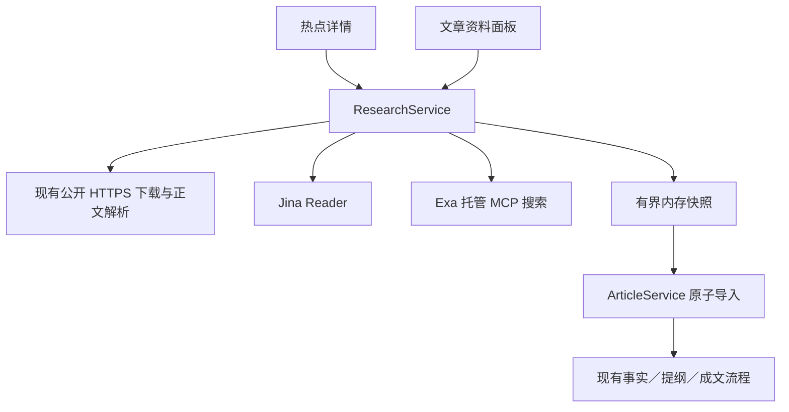

# Agent Reach 能力接入：资料搜索、阅读与创作路线

日期：2026-10-08。状态：用户已认可方向；本文件及配套计划仅描述待实施工作，尚未实现。

用户认可的顺序：共用资料搜索与阅读（同时服务热点详情、文章创作）→ 小红书对标 → B站／YouTube 内容输入与 Skills 蒸馏。书面规格与计划由代理自行复核。本次授权交付实现文档，不启动业务代码开发、工具安装、平台登录或发布。

第一期执行入口：[实施计划](../plans/2026-10-08-content-research-phase-one.md)。后续各期在进入开发前按本路线补写独立规格和任务计划，沿用已认可方向；只有出现实质范围变化或缺少必要信息时再询问。

## 1. 现状与研究证据

| 现有模块 | 代码真源 | 缺口 |
| --- | --- | --- |
| 热榜／收藏 | `src/lib/hotspots.ts`、`hotspot-sources.ts`、`renderer/src/pages/HotspotsPage.tsx` | 有标题、排名、热度及部分摘要；标题打开外部浏览器，没有应用内详情 |
| 文章资料 | `src/lib/article-sources.ts`、`articles.ts`、`article-types.ts` | 支持已知公开链接和文字；无全网搜索，动态／聚合页常需补材料 |
| 文章写作 | `src/lib/article-writing.ts` | 已有资料、事实、提纲、正文引用链，可复用 |
| 公众号对标 | `src/lib/wechat-benchmarks.ts`、`wechat-search.ts` | 搜狗文章线索，公众号身份／阅读量有专用规则，不能直接容纳小红书 |
| 视频输入／转录 | `src/lib/media.ts`、`jobs.ts`、`asr.ts` | 抖音为主要业务输入，转录使用本地 whisper.cpp |
| Skills 蒸馏 | `src/lib/skill-generation.ts`、`src/app.ts` 的 Skills 路由 | 主要从合集转录提取方法，缺少统一网页／字幕资料入口 |

研究基线为 Agent Reach 提交 `94f06c1969dfc1834001269d79d3ad0972d9dee6`。它主要负责安装、配置和诊断，阅读／搜索交给上游工具；不能把安装完成或 doctor 正常称为目标内容已读取。

本次只读抽查五源榜单均得到条目。Jina 读取一条头条事件页得到约 17212 字符，识别到两篇文章及两个视频链接；一条知乎问题只返回目标站 403 提示，没有回答正文。此证据只支持事件页获取及候选发现，未验证候选文章全文、B站字幕、小红书读取或搜索质量。实施期间必须重新读取公开样本并记录结果。

## 2. 选型与分期

采用应用后端的有限能力适配器：业务调用统一接口，适配器负责请求、解析、状态与失败。第一期直接连接 Jina Reader 和 Exa 托管 MCP，不整体安装 Agent Reach，不读用户 Codex／Claude／mcporter 配置。后续仅按需要选择其推荐的平台工具。

比较过的替代方案：整体嵌入 Python CLI 会增加桌面运行时、全局配置和工具依赖；全部自研平台采集器会重复维护平台差异。选定的适配器方案可复用现有 Node／TypeScript 代码，并让某一家服务失败局限在资料获取操作。

| 阶段 | 交付 | 验收终点 |
| --- | --- | --- |
| 第一期 | 公共资料搜索／阅读、热点详情、文章选材 | 用户能查看可读报道，选择真实正文进入文章资料；失败不伪造正文 |
| 第二期 | 小红书只读搜索、笔记／评论读取、独立对标 | 样本可恢复，互动指标有来源与观察时间，分析关联样本 |
| 第三期 A | B站／YouTube 搜索、详情、字幕与显式转录 | 来源可区分，具体视频／字幕可导入，不把无字幕当成功 |
| 第三期 B | 网页／笔记／字幕参与 Skills 蒸馏 | 用户选择资料集，生成方法与模板并能追溯来源，兼容旧合集 |
| 后续可选 | RSS／V2EX 等垂直选题、读者需求归纳 | 独立扩展，不是前三期完成条件 |

视频渲染、字幕图集排版、在线音频下载和平台发布执行器不在本改造范围。原视频手动四步、本地 ASR、previewRevision、draftOnly、outcomeUncertain 和发布渠道契约继续沿用。

## 3. 第一期用户流程

### 3.1 热点详情

标题改为「查看详情」按钮，打开共用 Modal 的大尺寸阅读窗口，收藏页同样可用。首次展示本地已有摘要、平台、榜单排名、原始热度、榜单获取时间和原文入口，不自动请求正文或搜索。仍保留原热榜 CSS 多列、刷新限制、收藏及备注保护。

用户点击「读取来源」后请求详情；话题页展示事件描述和候选报道，文章页展示正文，挑战页显示「未读取到正文」及失败原因。百度／知乎已有摘要即时可看，但标为「榜单摘要」。抖音／B站首期可看元信息并搜索相关报道，不承诺原视频内容可读。

点击「搜索相关报道」以标题为初始搜索词，可修改；点击候选后单独读取。详情中的主题匹配由用户核对，相关搜索结果不冒充平台原生事件内容。只读取用户选中的链接，不自动递归抓取候选。

选择最多 3 份可读正文后「用于文章创作」，一次创建含热点快照和选中资料的新文章。原有不选资料的「以此创作公众号文章」入口继续可用。

### 3.2 文章取材

在 `ArticleDetailPage` 的资料区增加复用的搜索／阅读面板；关键词默认来自文章，可编辑。返回标题、域名、原文链接、可选发布时间及搜索摘录；未读时标为「搜索线索」。用户逐条读取，再勾选最多 3 份加入文章。

导入必须带文章当前 version，服务端一次检查归属、正文哈希、过期、重复 URL 和总数，成功后一次保存。失败不部分导入、不丢搜索选择。导入不自动运行 evidence 或后续步骤；按现有规则使 evidence 及后续结果失效，保留旧结果供参考。

保留手动加链接、补文字和现有 `/sources/read`。老资料不需要迁移；没有启用外部服务仍能按现有流程创作。

## 4. 第一期架构与接口



### 4.1 服务职责

- `research-types.ts`：统一搜索、阅读、配置及错误类型；前端类型采用现有后端类型引用模式。
- `research-providers.ts`：固定外部端点的 Jina 阅读与 Exa 搜索。Exa 使用官方 Node MCP SDK，不调用 shell；只允许 `web_search_exa`。初始化／列工具／调用均在用户搜索时发生，退出或超时关闭传输。
- `research-content.ts`：纯解析与分类，移除导航、脚本、登录提示，保留来源与候选；使用已有 cheerio。Jina 的 Markdown 与直接 HTML 各自解析，不把 Markdown 送入 HTML 提取器。
- `research-service.ts`：合并并发、限频、内存快照、归属、哈希和服务状态。
- `research-routes.ts`：请求校验与本机会话；`app.ts` 创建唯一共用服务并注入 ArticleService。
- `article-sources.ts`：保留既有公开 URL／DNS 安全函数及直接读取。ResearchService 复用它们，向旧调用点提供兼容的 `ArticleSourceRead`。

MCP 工具返回格式不是应用契约：实施第一项采集匿名脱敏输出夹具，锁定当时工具 schema。优先校验 structuredContent；文本结果只接受夹具覆盖的确定性记录格式。格式变化返回 `unsupported_format`，不得让 AI 编造 URL／正文。若免费搜索不可达，本地阅读与候选发现仍交付，搜索明确标不可用，不能把空数组伪装为搜索成功。

### 4.2 拟新增的数据类型

```typescript
type ResearchProvider = 'direct' | 'jina' | 'exa';
type ResearchErrorCode = 'disabled' | 'not_found' | 'unsafe_url' | 'blocked'
  | 'rate_limited' | 'timeout' | 'too_large' | 'unsupported_format' | 'upstream';
interface ResearchCandidate {
  id: string; title: string; url: string; domain: string;
  snippet?: string; publishedAt?: string; provider: ResearchProvider;
}
interface ResearchSearchResult {
  searchId: string; query: string; candidates: ResearchCandidate[];
  fetchedAt: string; expiresAt: string; cached: boolean;
}
interface ResearchReadResult {
  readId: string; url: string; title: string;
  kind: 'article' | 'topic' | 'unreadable';
  status: 'readable' | 'needs_material';
  text: string; excerpt?: string; publishedAt?: string;
  readAt: string; expiresAt: string; hash: string; truncated: boolean;
  provider: ResearchProvider; candidates: ResearchCandidate[];
  error?: { code: ResearchErrorCode; message: string };
}
interface ResearchSelection { readId: string; hash: string }
```

`readable` 只用于确认解析到文章正文；topic 与 unreadable 均为 needs_material，`text` 为空。话题描述放 excerpt，候选搜索摘录放 snippet，二者不能导入事实证据。正文可用性不是事实真实性认证；至少 200 字符只是一条下限，不能独立证明正文识别成功。

所有时间为 ISO 字符串；publishedAt 只来自有效来源字段，不用 fetchedAt/readAt 替代。hash 为保存的正文文本 SHA-256；truncated 表示发生裁切。`ArticleSourceRead` 增加可选 `readProvider` 与 `sourceKind`，旧字段保持兼容；`ArticleMaterial` 导入的 `url` 始终为原始来源，不是 Jina 代理链接。

### 4.3 HTTP 契约

| 接口 | 请求 | 响应及作用 |
| --- | --- | --- |
| `GET /api/research/status` | 无 | 启用状态、最近请求结果／时间；未请求时标未验证，不主动访问外网 |
| `POST /api/research/search` | `{query}` | `{result: ResearchSearchResult}`，不读取文章、不修改文章 |
| `POST /api/research/read` | `{url}` 或 `{searchId,candidateId}`，二选一 | `{result: ResearchReadResult}`，不保存文章 |
| `POST /api/hotspots/detail` | `{sourceId,itemId}` | `{item, result: ResearchReadResult}`；item 从榜单或收藏解析，补足已有摘要，不接收客户端标题／URL |
| `POST /api/articles/:id/sources/import` | `{version,selections: ResearchSelection[]}` | `{article: ArticleRecord}`，全部成功或全部不写 |
| 现有 `POST /api/articles` | 可选增加 `{researchSelections}` | 一次创建带资料的文章；热点身份仍由服务端解析 |

除 status 外新增接口均 requireActor；快照绑定本机会话的操作者 userId，不允许跨操作者使用 ID。read 成功响应 200 也可能 needs_material；搜索传输失败为 502、超时 504、禁用 422、限频 429。参数 400，无会话 401，热点不存在 404；快照不存在／已过期／重启丢失统一 410，哈希／文章版本冲突 409，重复资料或超出文章限额 422。每种错误均给可读信息，不暴露凭据或整段上游响应。

ArticleService 注入 `resolveResearchSelections(userId,selections): Promise<ArticleSourceRead[]>`，由装配层调用 `ResearchService.resolveSelections(userId,selections)`；后者映射 provider→readProvider、kind→sourceKind、candidates→links，保留原始正文与 hash。取材解析发生在串行保存前；持久化前再次核对 article version 与 running。create 接受 actor userId；import 保持文章同一套可编辑判断，不重写权限模型。快照不在导入后消费或删除，用户在窗口重复尝试时仍可解析；文章本身的重复 URL 检查阻止重复添加。

### 4.4 阅读与搜索执行规则

- 普通文章：先直接读取（15 秒），未得到正文且 Jina 已启用时尝试 Jina（最多 30 秒）；每条总截止 50 秒，传输实际取消而不是只用 Promise.race 放弃等待。
- 已知搜索／话题／知乎问题入口：允许通过 Jina 获取话题描述和候选，但路径分类仍阻止将其整体当文章。第一期重点识别头条事件页及百度搜索候选；知乎不保证公开回答读取；抖音／B站失败提示选择相关报道。
- 外部响应最多 2 MiB（流式计数，包括 MCP／SSE 解码前字节），正文最多 20000 字符，话题描述最多 1000 字符，候选最多 10 条；拒绝超限，不先整包加载。旧文字资料 30000 字符不变。
- 搜索 query 去首尾空白后 1～500 字符，一次请求最多 5 个结果，30 秒总截止。显示原始结果，不让模型生成或扩写搜索摘录。
- 同操作者、同操作键（规范 query 或规范 URL）并发合并；同键再次网络请求至少间隔 60 秒，失败也计入。同操作者最多 3 个外部操作并发；满额返回 429 与 retryAfterSeconds。
- 搜索缓存 10 分钟，阅读快照 30 分钟；默认复用有效缓存。搜索／阅读快照合计每操作者最多 100 条、全服务序列化字节总量最多 20 MiB，LRU 驱逐，过期或被驱逐返回 410。快照不落盘；重启要求重新搜索／读取。
- 缓存匹配包含当前启用配置指纹；禁用服务后不以旧服务缓存冒充当前仍可读取，但已获取且未过期的正文快照可继续显式导入。限频时间表独立于内容 LRU，保留至少 60 秒；驱逐缓存不能绕过限频。
- 文章最多 10 份资料；新导入每批 1～3 份。选中正文持久化到现有 `cache/articles.json`，不引用易过期内存条目，文章恢复和已建发布包不依赖研究缓存。
- 原 `/sources/read` 仍每批最多 3 个；50 秒阅读截止下前端超时统一 65 秒。热点／通用阅读也使用 65 秒，搜索使用 40 秒，不混入 AI 生成的超时配置。

### 4.5 配置与网络边界

第一期配置为 `research: {jinaEnabled:boolean, exaEnabled:boolean}`，新旧用户缺省均 false。设置「资料搜索与阅读」提供两个开关，说明 Jina 接收公开链接、Exa 接收搜索词，并受其服务限额约束；开关不触发测试、不启动登录。用户启用后仅在主动读取／搜索时使用服务，无后台采集。

Electron 写入正确的 userData/config.json，以 resolveResearchConfig 回调即时读取；独立后端仅用 `RESEARCH_JINA_ENABLED=1`／`RESEARCH_EXA_ENABLED=1`，前端只展示状态及启动配置说明，不能将键写入 `~/.douyin-ai-video/config.json` 并宣称已对独立服务生效。浏览器开发态连接哪一种后端，就展示该后端能力。

Exa 固定连接 `https://mcp.exa.ai/mcp?tools=web_search_exa` 的匿名限额模式，不自动加 Key、OAuth 或调用 agent_run，不将“免费限额”描述为无限免费。Jina 固定 `https://r.jina.ai/`，不转发用户 Cookie／Authorization。禁止读取发布 profile、自动调用平台登录、复用系统 Chrome 会话或改写全局 MCP 设置。

所有原始 URL、候选 URL、外部返回的 URL 使用 articlePublicUrl 与公网 DNS 验证；直接请求固定已检查地址、禁用重定向。固定服务端点同样检查 DNS 并禁止重定向；MCP 自定义传输 fetch 必须真正使用有界请求、截止与地址绑定。代理服务实际访问目标的 DNS／重定向由第三方执行，本地校验不能宣称控制该过程，因此不向代理发送私有链接、签名访问链接或平台凭据。

前端显示文字及经校验链接，不加载外部脚本／iframe，不自动展示或下载外部图片；首期正文以纯文本段落呈现。外部材料内的指令作为资料文本处理，不可改变 AI 角色、配置、工具权限或发布动作。写作仍校验 quote 属于实际保存的 source.text。

## 5. 第二期：小红书对标的独立边界

新增小红书对标入口与 `XhsResearchProvider.search/readNote/readComments`。先验证 Agent Reach 推荐的 OpenCLI／xiaohongshu-mcp 在目标机器的真实能力，再选一个首选后端；不将多个未经验证的后端都列为“已支持”。平台返回完整 URL 和 xsec_token 后才读取笔记，不能只拼裸 ID。

浏览器会话只在用户明确选择读取方案后接入，独立于当前发布执行器的专用 profile；现有应用小红书扫码成功不意味着 OpenCLI 已登录。不得把用户发布草稿或专用 IndexedDB 暴露给采集器。仅搜索、阅读与评论，不自动点赞、关注、评论或发布。

新建独立 `cache/xhs-benchmarks.json`，沿用 version、原子串行写入和损坏拒绝覆盖。样本保存原始笔记身份、来源 URL、标题、正文／摘录、作者、指标与 observedAt；缺失指标为 null，不把点赞量换算阅读量。每组最多 20 个样本，每篇首轮最多 20 条评论，不自动翻页。用户选择样本后分析标题、开头、结构与评论问题，输出引用 sampleId；旧样本失效时保留快照并标记观察时间。

独立任务顺序：真实只读能力探针 → 样本存储与版本测试 → 搜索／阅读面板 → 引用样本的分析 → 文章资料导入。验证无登录、失效 token、限频、指标未知、版本冲突、分析错误引用和发布 profile 隔离。此期不改变公众号 benchmarkAssessment。

## 6. 第三期：多平台视频与 Skills

### 6.1 视频输入

为 B站／YouTube 分别增加 `VideoResearchProvider.search/getVideo/getCaptions`。B站元信息／搜索优先评估 bili-cli，字幕评估 OpenCLI；YouTube 复用已打包的 yt-dlp。工具真实兼容性与目标机安装方式先验证，缺少依赖时给明确说明，不能在产品请求中 npx／pip 自动安装。

来源模型增加 platform 与原始具体视频 ID，搜索结果须先选择具体视频。官方／作者字幕、自动字幕、本地 ASR 分别标记；自动字幕去重不伪造时间轴。无字幕时由用户显式选择下载／转录，继续用本地 whisper.cpp，不改接 Agent Reach 的 Groq／OpenAI 转写。

先交付详情和字幕作为文章文字资料；再扩展任务创建、下载与四步主流程，避免只有通用 URL 解析成功却在抖音专用取数环节失败。合集仍保留现有抖音模型；跨平台合集需要独立规格，不能冒充已有支持。字幕不等于视频文件，字幕资料不能满足图集原视频或成片依赖。

任务顺序：来源模型／解析与下载边界 → 搜索／字幕适配及真实样本 → 文章资料导入 → 手动视频任务适配与旧抖音回归。验收须覆盖无字幕、语言选择、多分 P、部分下载、失败重试及归属；不得沿用第三方“B站全部无法使用 yt-dlp”的陈述代替本机验证。

### 6.2 Skills 蒸馏

增加 `SkillMaterial`（id、kind、来源、正文、hash、获取时间、字幕来源），用户显式选择资料集后构造 context。兼容旧 SkillTranscript 与现有 buildSkillContext 的 12000 字符默认预算，不借扩展资料类型无限增加模型上下文。

网页、笔记、字幕经服务端来源解析进入资料集；用 sourceId/hash 保存输入快照，输出方法、模板及来源映射，不把阅读资料自带的指令当可执行技能。写入个人 Skills 目录仍是单独的用户动作；对外阅读／发布不会因蒸馏自动触发。

任务顺序：资料类型与旧合集映射 → 资料选择／快照 → 有预算的生成与引用校验 → 页面恢复及旧 Skills 回归。验收包括重复 URL／hash、预算截断提示、材料不足、旧合集兼容、伪造引用及外部指令。

## 7. 第一期验收标准与风险

| 编号 | 可观察结果 |
| --- | --- |
| R1 | 热榜／收藏标题打开详情，已有摘要不用联网；原文入口保留，五来源读取失败各自可见 |
| R2 | 头条事件页展示候选；搜索／问题／挑战页不能导入正文，HTTP 200 的目标站 403 同样识别失败 |
| R3 | Exa 搜索返回校验后的真实链接；缺省未启用、限频、schema 变化、网络失败与真实空结果区分 |
| R4 | 普通公开文章通过 direct／Jina 阅读，来源、时间、hash、截断状态准确；文字内恶意链接或脚本不可执行 |
| R5 | 1～3 份选材原子导入／创建，超总数、重复、跨操作者、过期、hash／version 冲突拒绝，失败保留选择 |
| R6 | 旧文章资料／写作／发布回归通过；导入使下游失效，quote 必须存在于保存正文，包仍自包含 |
| R7 | URL／混合 DNS／重绑定／重定向／超限流／取消与超时有实际测试，限频和缓存有确定性时钟测试 |
| R8 | 浅深主题、390px 窄屏、焦点／关闭／请求乱序、未保存文章编辑保护可走查；不改变热榜多列 |
| R9 | 两运行入口配置即时读取，禁用不访问远端；编译对应产物后，在 Electron 与 HTTP 两模式复核 |
| R10 | 离线测试与真实来源记录分开；真实中文搜索用至少三个不同领域选题人工核对前五条的相关性，不声称所有站点可读 |

实现中的能力探针可以记录不可达／限频；这是实际限制，不能靠假数据补齐“真实通过”。若中文搜索效果不满足取材需求，保留手动链接流程并记录后续中文搜索适配器需求，不自动切换付费服务。用户事实核验与最终文章审阅继续存在。

## 8. 来源与内部复核

- [Agent Reach 核心职责](https://github.com/Panniantong/Agent-Reach/blob/94f06c1969dfc1834001269d79d3ad0972d9dee6/agent_reach/core.py)。
- [网页读取方案](https://github.com/Panniantong/Agent-Reach/blob/94f06c1969dfc1834001269d79d3ad0972d9dee6/agent_reach/skill/references/web.md)、[搜索方案](https://github.com/Panniantong/Agent-Reach/blob/94f06c1969dfc1834001269d79d3ad0972d9dee6/agent_reach/skill/references/search.md)。
- [社交平台](https://github.com/Panniantong/Agent-Reach/blob/94f06c1969dfc1834001269d79d3ad0972d9dee6/agent_reach/skill/references/social.md)、[视频／字幕](https://github.com/Panniantong/Agent-Reach/blob/94f06c1969dfc1834001269d79d3ad0972d9dee6/agent_reach/skill/references/video.md)。
- [Exa 官方 MCP：匿名限额及工具列表](https://exa.ai/docs/get-started/exa-mcp)。核对日期 2026-10-08；SDK 版本、实际 schema 与输出夹具在实施探针任务锁定，不依赖移动版本自动更新。
- [Jina Reader 官方实现与限制](https://github.com/jina-ai/reader)。第三方代码如复制需保留各自许可；仅调用接口不等于把 Agent Reach 整仓库引入打包。
- 既有约束：[热点规格](2026-09-30-hotspots-design.md)、[热点到文章规格](2026-09-30-hotspot-wechat-writing-design.md)、仓库 `AGENTS.md`。

内部复核结论（2026-10-08）：分期与认可顺序一致；第一期无平台登录／发布或额外凭据；定义了搜索与阅读的失败和真实性边界、一次性原子导入、两入口配置与缓存生命周期。后续阶段没有冒称已验收，也未将既有专用发布 profile 视为通用采集登录态。配套计划须覆盖 R1～R10。
