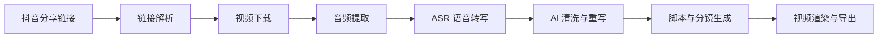

# AI 技术分享视频生成项目技术方案

## 1. 项目目标

输入抖音分享链接后，自动提取视频中的文案、字幕、口播或页面信息，并通过 AI 清洗整理成适合“AI 技术分享”风格的内容，最终生成可用于视频制作的脚本、字幕和分镜数据。

本项目主要聚焦以下内容类型：

- Skills 使用技巧分享
- AI 工具实战分享
- Agent 常用指令与工作流
- 工具对比、踩坑总结、最佳实践

## 2. 核心流程



## 3. 系统模块

### 3.1 链接解析层

职责：

- 识别用户输入的抖音分享链接
- 获取视频页面、标题、作者、发布时间等基础信息
- 优先解析页面直链完成视频下载，必要时再回退到 `yt-dlp`
- 做重复链接去重
- 判断链接是否可访问、是否失效

输出：

- `source_url`
- `video_id`
- `title`
- `author`
- `publish_time`
- `status`

### 3.2 内容提取层

职责：

- 下载视频本体
- 提取音频
- 使用 ASR 识别口播
- 后续可补充 OCR 与页面文案作为辅助信息

优先级建议：

1. 视频音频 ASR
2. 页面基础信息
3. OCR 补充

### 3.3 AI 清洗层

职责：

- 去口语化
- 去重复
- 修复断句
- 统一术语
- 改写成适合技术分享短视频的表达

目标输出风格：

- 开场有钩子
- 内容结构清晰
- 适合口播
- 适合字幕展示

### 3.4 脚本生成层

职责：

- 生成口播稿
- 生成字幕稿
- 生成分镜列表
- 生成封面标题
- 生成结尾 CTA

建议固定输出结构：

- 开场钩子
- 问题背景
- 核心要点 3 到 5 条
- 实操示例
- 总结收尾

### 3.5 视频渲染层

职责：

- 将脚本和字幕渲染为视频
- 支持竖屏短视频模板
- 支持动态字幕、标题卡、重点高亮
- 支持封面图生成

建议优先支持的成片形态：

- 纯字幕视频
- 旁白 + 字幕视频
- 分镜卡片式短视频

## 4. 推荐技术栈

### 前端

- Next.js
- React
- Tailwind CSS

用途：

- 提交链接
- 查看解析结果
- 编辑脚本
- 管理任务

当前实现：

- 先用本地网页工作台落地最小可用 UI
- 后续可再把这层迁移到 Next.js 或直接包成 Electron 桌面壳

### 后端

- FastAPI 或 NestJS

用途：

- 解析链接
- 调用 AI
- 调度任务
- 管理视频生成流程

### 任务队列

- Redis
- Celery 或 BullMQ

用途：

- 处理耗时任务
- 下载素材
- ASR
- OCR
- 视频渲染

### AI 能力

- 文案清洗
- 标题生成
- 分镜生成
- 脚本重写

可接入：

- OpenAI
- Claude
- 本地模型

### 音视频处理

- FFmpeg
- Whisper 或其他 ASR
- OCR 工具

## 5. 本地存储设计

项目第一版建议全部使用本地存储，便于快速开发和调试。

### 5.1 本地文件结构

```text
storage/
  raw/
    videos/
    audio/
    text/
    page/
  processed/
    scripts/
    cleaned/
    scenes/
    subtitles/
  output/
    videos/
    covers/
  logs/
  cache/
```

### 5.2 存储内容

- 原始视频文件
- 音频文件
- 视频 metadata
- 提取出的原始文案
- AI 清洗后的脚本
- 分镜 JSON
- 字幕文件
- 成片视频
- 封面图
- 任务日志

### 5.3 好处

- 开发简单
- 调试方便
- 成本低
- 便于快速迭代

## 6. 数据结构建议

统一使用 JSON 作为中间数据格式，方便各模块解耦。

```json
{
  "source_url": "",
  "video_id": "",
  "title": "",
  "topic": "skills分享",
  "raw_text": "",
  "clean_script": "",
  "voiceover_script": "",
  "cover_title": "",
  "tags": ["AI", "skills", "agent"],
  "scene_list": [
    {
      "scene": 1,
      "duration": 5,
      "caption": "这个技能能帮你省下 30 分钟",
      "visual": "标题卡 + 重点高亮"
    }
  ],
  "status": "draft"
}
```

## 7. 内容模板建议

### 7.1 Skills 分享模板

- 这个技能解决什么问题
- 怎么用
- 适合谁
- 常见坑
- 总结一句话

### 7.2 Agent 指令模板

- 一句话说明用途
- 命令示例
- 适用场景
- 注意事项
- 提效方式

### 7.3 工具实战模板

- 为什么推荐
- 核心能力
- 我的使用方式
- 替代方案
- 结尾总结

## 8. MVP 范围

第一版建议只做最小闭环：

1. 输入抖音分享链接
2. 自动提取原始内容
3. AI 清洗为技术分享脚本
4. 输出可用于视频制作的 JSON 和字幕

暂不强制做：

- 全自动复杂特效渲染
- 多平台分发
- 数据分析后台
- 用户权限系统

## 9. 实施顺序

1. 搭建项目骨架
2. 实现链接解析
3. 实现内容提取
4. 实现 AI 清洗
5. 实现脚本与分镜生成
6. 接入本地视频渲染
7. 加前端任务工作台

## 10. 风险与边界

- 仅处理用户提供的公开视频链接
- 不绕过访问限制
- 内容生成阶段尽量保持原创重写
- 视频成片尽量使用模板化视觉，减少搬运风险

## 11. 下一步建议

如果要继续推进，建议下一步直接落地：

- 项目目录结构
- 接口设计
- 本地存储读写模块
- 第一版内容提取与清洗流程
